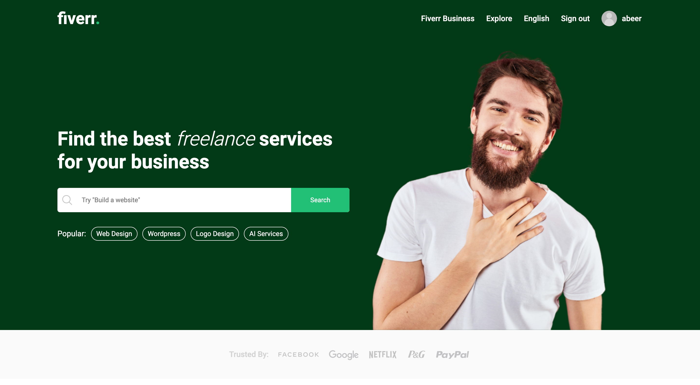

# Fiverr Clone App

## Table of Contents
* General Information
* Technologies Used
* Features
* Screenshots
* Installation and Setup Instructions
* Usage
* Project Status
* Room for Improvement
* Acknowledgements
* Contact

## General Information
The Fiverr Clone App is a platform that connects freelancers with clients, allowing freelancers to offer their services and clients to find and hire freelancers. This project is built using a combination of technologies including ReactJS, Node.js, MongoDB, Express, Axios, and various other libraries and tools.

### Purpose of this Project
The purpose of this project is to create a platform that mimics the functionality of Fiverr, demonstrating full-stack development skills.

## Technologies Used
* ReactJS
* Node.js
* Express
* MongoDB
* Axios
* React Router
* Bootstrap
* JavaScript
* HTML
* CSS
* JWT (JSON Web Tokens)

## Features
* User registration and login
* Freelancer and client profiles
* Gig listings
* Gig creation and management
* Messaging system
* User reviews and ratings
* Gig search and filter functionality
* Secure payment processing with Stripe integration

## Screenshots
Home Page 

## Installation and Setup Instructions
To get the Fiverr Clone App up and running on your local machine, follow these steps:

1. Clone this repository.
2. Make sure you have Node.js and npm installed.
3. Install server dependencies: cd server => npm install
4. Install client dependencies: cd client => npm install
5. Start the server: cd server => npm start
6. Start the client: cd client => npm start
7. Visit the app at `http://localhost:5173/`

## Usage
### User Registration and Login
* Users can register for a new account or log in using their credentials.

### Gig Listings
* Freelancers can create gig listings, and clients can browse and search for gigs they're interested in.

### Messaging System
* Users can communicate with each other using the built-in messaging system to discuss gig details and requirements.

### Profile Pages
* Users have their own profile pages where they can manage their gigs, view reviews, and update their information.

## Project Status
The Fiverr Clone App is currently in a completed state.

## Room for Improvement
* Implement payment processing for gig transactions.
* Add real-time notifications.
* Enhance the user interface and user experience.

## Acknowledgements
Special thanks to LamaDev for the inspiration and guidance in building this project.

## Contact
Created by [Abeer Ahmed](https://www.linkedin.com/in/abeerdev/) - feel free to contact me.

